# LEMON Pipeline Diagram

## Complete Workflow-to-Code Pipeline

```mermaid
flowchart TD
    A[📸 workflow.jpeg] --> B[🔍 Workflow Analysis]
    
    B --> C1[📄 workflow_analysis.json]
    B --> C2[📥 workflow_inputs.json]
    B --> C3[📤 workflow_outputs.json]
    
    C2 --> D[🎲 Generate Test Cases]
    D --> E[📋 test_cases.json]
    
    E --> F[🏷️ Label Test Cases]
    C3 --> F
    A --> F
    C1 --> F
    F --> G[✅ labeled_test_cases.json]
    
    C1 --> H[💻 Generate Code]
    A --> H
    H --> I[📝 workflow_code.py]
    
    G --> J[🧪 Run Tests]
    I --> J
    C3 --> J
    J --> K{Pass Rate?}
    
    K -->|< 100%| L[🔧 Refine Code]
    L --> H
    
    K -->|100%| M[✨ Final Code]
    
    style A fill:#e1f5ff
    style M fill:#c8e6c9
    style K fill:#fff9c4
```



## Pipeline Steps

### 1. **Workflow Analysis** (`main.py`)
```bash
python main.py
```
**Input:** `workflow.jpeg`  
**Outputs:**
- `workflow_analysis.json` - Complete structured analysis
- `workflow_inputs.json` - Standardized input definitions
- `workflow_outputs.json` - All possible output states

**What it does:** Uses Azure OpenAI GPT-5 to analyze the workflow diagram and extract all inputs, decision points, paths, and outputs.

---

### 2. **Generate Test Cases** (`generate_test_cases.py`)
```bash
python generate_test_cases.py -n 100 -s comprehensive
```
**Input:** `workflow_inputs.json`  
**Output:** `test_cases.json`

**What it does:** Creates test cases with all input combinations based on the strategy:
- `comprehensive`: Cover all edge cases and combinations
- `random`: Random sampling across input space
- `edge_cases`: Focus on boundary values

---

### 3. **Label Test Cases** (`label_test_cases.py`)
```bash
python label_test_cases.py
```
**Inputs:**
- `test_cases.json` - Unlabeled test cases
- `workflow.jpeg` - Visual reference
- `workflow_outputs.json` - Valid outputs
- `workflow_analysis.json` - Structured context

**Output:** `labeled_test_cases.json`

**What it does:** Uses Azure OpenAI GPT-5 with vision to determine the expected output for each test case by analyzing the workflow logic. Processes in parallel batches.

---

### 4. **Generate Code** (Part of refinement pipeline)
```bash
python refine_workflow_code.py
```
**Inputs:**
- `workflow_analysis.json`
- `workflow.jpeg`
- `workflow_outputs.json`

**Output:** `workflow_code.py`

**What it does:** Generates deterministic Python code with a `determine_workflow_outcome()` function that implements the workflow logic.

---

### 5. **Run Tests** (`run_tests.py`)
```bash
python run_tests.py
```
**Inputs:**
- `workflow_code.py` - Generated code
- `labeled_test_cases.json` - Ground truth
- `workflow_outputs.json` - Valid outputs

**Output:** Test results with pass rate

**What it does:** Executes the generated code in an E2B sandbox against all labeled test cases and reports pass/fail statistics.

---

### 6. **Refinement Loop** (Automatic in `refine_workflow_code.py`)
If pass rate < 100%, the pipeline:
1. Analyzes failure patterns
2. Generates improved code with failure context
3. Re-runs tests
4. Repeats until 100% pass rate or max iterations reached

---

## Quick Start Commands

### Full Pipeline (Automated)
```bash
python -m src.lemon.core.pipeline
```
Runs steps 1-6 automatically.

### Manual Step-by-Step
```bash
# Step 1: Analyze workflow
python main.py

# Step 2: Generate test cases
python generate_test_cases.py

# Step 3: Label test cases
python label_test_cases.py

# Step 4-6: Generate and refine code
python refine_workflow_code.py

# Or just run tests on existing code
python run_tests.py
```

---

## File Dependencies

```
workflow.jpeg
    ↓
main.py → workflow_analysis.json
       → workflow_inputs.json
       → workflow_outputs.json
    ↓
generate_test_cases.py → test_cases.json
    ↓
label_test_cases.py → labeled_test_cases.json
    ↓
refine_workflow_code.py → workflow_code.py
    ↓
run_tests.py → Test Results
```

---

## Configuration

### API Keys (`.env`)
```
AZURE_OPENAI_ENDPOINT=your_endpoint
AZURE_OPENAI_API_KEY=your_key
AZURE_OPENAI_DEPLOYMENT=gpt-5
E2B_API_KEY=your_e2b_key
```

### Parameters
- **Test case generation:** `-n` (count), `-s` (strategy), `--seed`
- **Test labeling:** `--batch-size` (default: 20), `--max-workers` (default: 5)
- **Code refinement:** `--max-iterations` (default: 5)

---

## Current Status Tracking

The pipeline includes emoji-based progress tracking:
- 📸 Analyzing workflow...
- 🎲 Generating test cases...
- 🏷️ Labeling test cases...
- 💻 Generating code...
- 🧪 Running tests...
- 🔧 Refining code...
- ✓ Complete!
